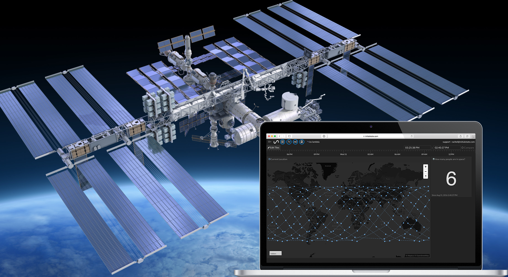
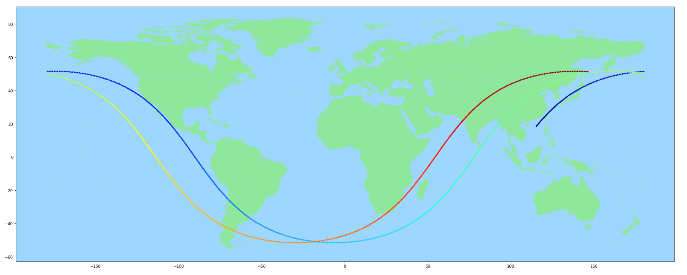

This Python program displays the live position of the International Space Station above a world map, along with additional information such as altitude, velocity and the daylight/night state. As the station moves, its orbital path is traced in real time. The ISS experiences 16 sunrises and sunsets every day, and travels at a speed of over 27000 km/h.

Live position data (latitude and longitude) sourced from http://open-notify.org/Open-Notify-API/ISS-Location-Now/  
Velocity, Altitude and Time-of-day data sourced from https://api.wheretheiss.at/v1/satellites/25544  

##Installation

install poetry: pip install poetry
git clone the repository
create a virtual environment, ex.: virtualenv .venv
go inside the virtual environment: poetry shell
install dependencies from poetry.lock: poetry install

Other dependencies
Mac: pyproj, GEOS, Basemap
https://matplotlib.org/basemap/users/installing.html
Win: pyproj, Basemap
pyproj -> pip install from wheels
basemap -> pip install from wheels
